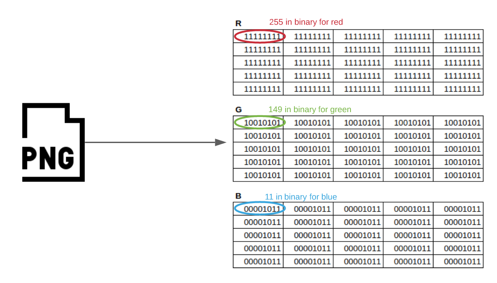
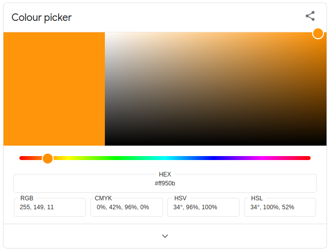
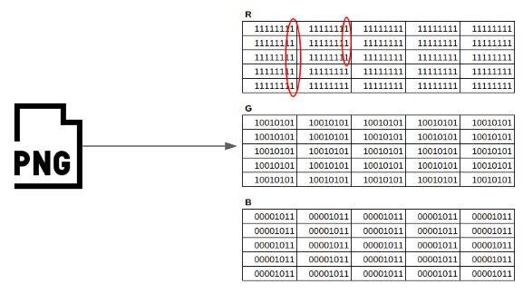
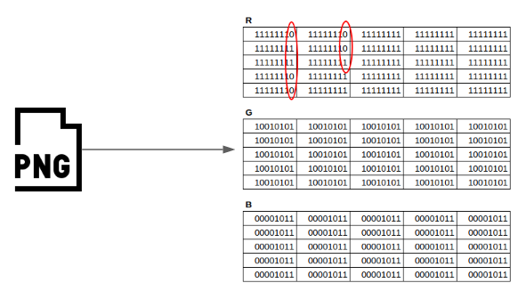
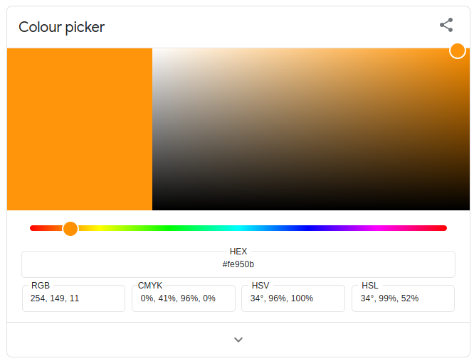
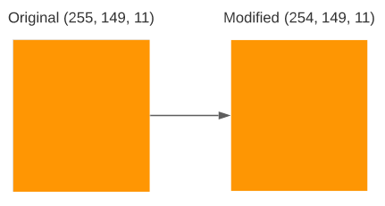
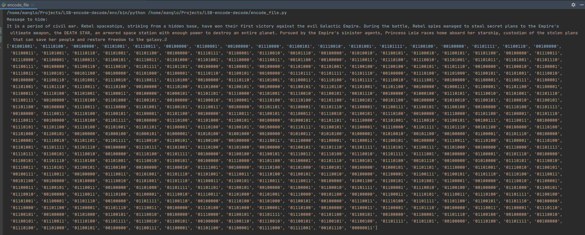
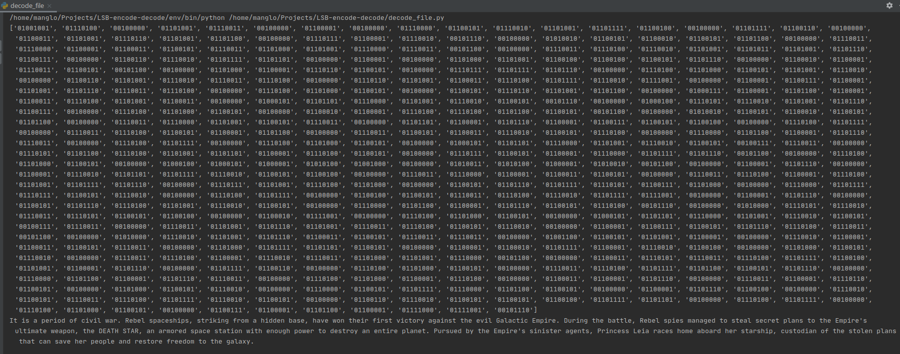

+++
title = 'Hide messages on PNG files!'
date = 2021-02-08T23:30:26+01:00
draft = false
tags = ['steg', 'steganography', 'python', 'LSB', 'github']
+++


So, recently one friend sent me a [hackthebox](https://www.hackthebox.eu/) style challenge he designed.
It consisted on some [steganography](https://en.wikipedia.org/wiki/Steganography) problems in which I had
to manage to get some information from an image file.

In one of those challenges I had to access some data hidden using a technique called **LSB (Least Significant Bit) Based 
Steganography**. This technique consists on the modification of the least significant bit of every byte of every pixel on an image.
This bit is the one adding the least information to the byte. This is where we will encode each bit of our message. This way, the
change on the image is imperceptible to the human eye, being the modified image almost completely equal to the original
file.

Interesting, right? If you want to learn more about it, just continue reading.

To understand this concept lets see a simplified example. 

> tl;dr: If you just need some code to hide text in PNG images and to read it from them, just check this 
>[repo on Github](https://github.com/manglaneso/LSB-encode-decode).


## Some boring theory
Let's take a small PNG image file:

 

This image consists of a grid of 5x5 pixels. Each pixel consists of 3 bytes, each representing the value of the 
Red, Green and Blue channel:

 

Each pixel represents the color **RGB(255, 149, 11)**, or **#ff950b** in hexadecimal, which looks like the following image:

 

So, imagine we want to hide a message in this file. To keep it simple, let's try to hide the letter **'a'**, 
represented by the binary number **01100001** in ASCII encoding. How can we do it without anyone noticing? With the
LSB technique we'll modify the least significant bit of the first 8 bytes of the red channel of the image:

 

After we modify them, we get:

 

We ended up with our message hidden inside an image! But wait, we altered the original image doing it! Remember how
every pixel in our original image represented the color **RGB(255, 149, 11)**? Well, we changed some of the first 8 bytes of
the red channel from **11111111 (255)** to **11111110 (254)**, so now some pixels will represent the color 
**RGB(254, 149, 11)** instead of the original RGB(255, 149, 11)! Let's see how does this new color look like:

 


Can you spot any difference?

 

## Real world example

So, now we know how all this works, let's see a real world example with a real size image. I've put together two simple
Python scripts, one to hide ASCII messages in PNG files following the previously explained method, and another one to 
unhide them:

decode_image.py:
```
from PIL import Image

decode_map = {f'{i:08b}': chr(i) for i in range(0, 128)}

# EOT (End of text) character
end_of_text_char = '00000011'

extracted_bin = []

with Image.open("encoded_image.png") as img:
    width, height = img.size
    for x in range(0, width):
        for y in range(0, height):
            pixel = list(img.getpixel((x, y)))

            extracted_bin.append(pixel[0] & 1)
            # Uncomment to read the 3 bytes in every pixel.
            # for n in range(0, 3):
            #    extracted_bin.append(pixel[n]&1)

    decoded_bytes = []

    count = 0

    to_save = []

    to_save_string = ''

    for bit in extracted_bin:

        if count % 8 == 0 and count != 0:
            byte_string = "".join(to_save)

            # Check if EOT character found
            if byte_string == end_of_text_char:
                break

            # Check if character is the ASCII table
            try:
                to_save_string += decode_map[byte_string]
            except KeyError:
                pass

            decoded_bytes.append("".join(to_save))
            to_save = []

        to_save.append(str(bit))
        count += 1

    # Print the result
    print(decoded_bytes)
    print(to_save_string)
```

encode_image.py:
```
from PIL import Image

# Message to hide. Ended with the EOT (End of text) character.
message_to_hide = 'It is a period of civil war. Rebel spaceships, striking from a hidden base, have won \
their first victory against the evil Galactic Empire. During the battle, Rebel spies managed to steal secret \
plans to the Empire\'s ultimate weapon, the DEATH STAR, an armored space station with enough power to \
destroy an entire planet. Pursued by the Empire\'s sinister agents, Princess Leia races home aboard her \
starship, custodian of the stolen plans that can save her people and restore freedom to the galaxy.\x03'

encode_map = {chr(i): f'{i:08b}' for i in range(0, 128)}

print(f'Message to hide: \n{message_to_hide}'.format(message_to_hide=message_to_hide))

with Image.open("Rebel_Alliance_flag.png") as img:
    width, height = img.size

    available_storage = (width * height) / 8
    message_size = len(message_to_hide) * 8

    if message_size > available_storage:
        print('You are trying to store {message_size} bytes in {available_storage} bytes'.format(
            message_size=message_size, available_storage=available_storage))
        exit()

    height_count = 0
    width_count = 0

    encoded_bytes = []

    for char in message_to_hide:

        encoded_char = encode_map[char]
        encoded_bytes.append(encoded_char)

        for bits in encoded_char:

            for bit in bits:
                if height_count == height:
                    width_count += 1
                    height_count = 0

                pixel = list(img.getpixel((width_count, height_count)))

                # Encode the message just in the Red channel
                pixel[0] = pixel[0] & ~1 | int(bit)

                # Uncomment to encode the message in the three channels
                # for n in range(0, 3):
                #     pixel[n] = pixel[n] & ~1 | int(bit)

                img.putpixel((width_count, height_count), tuple(pixel))

                height_count += 1

    print(encoded_bytes)

    # Save modified image
    img.save("encoded_image.png")
```

Using the encoding script we will try and hide the **Star Wars Episode IV: A New Hope** film crawl inside the following
220x174 pixels Rebel Alliance flag:


After running the **encode_file.py**, we can see the following output through the terminal, where we find the message
to hide in plain text, and represented as a list of ASCII encoded bytes:



Finally we end up with the following image:


Can you see any difference with the original? (You can download it yourself and try to decode it!)

Okay, so now, let's see if the message is really there (and if our **decode_file.py** works properly). If we run
it, we can see the following message through the terminal:



We can see the same list of ASCII encoded bytes and the **Star Wars Episode IV: A New Hope** film crawl! Yay it works!

## Conclusions

If you got this far, thanks for reading! I hope you learn something today.

Also, if you want easy access to the code, with the example image and the LICENSE and all that stuff, check the 
[repo on Github!](https://github.com/manglaneso/LSB-encode-decode). 