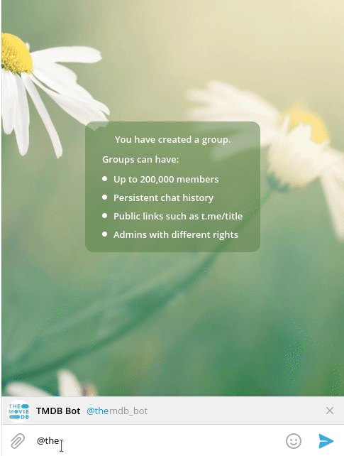

+++
title = 'themdb_bot'
date = 2021-03-08T16:35:15+01:00
draft = false
tags = ['project', 'telegram', 'bot', 'themoviedb', 'tmdb', 'google-apps-script']
+++

[IMDB Telegram bot](https://t.me/imdb) clone using [TMDB](https://themoviedb.org) to get info about movies and TV shows.

Just write @themdb_bot in any Telegram chat and start using it! Yoy can also talk to it clicking on the [following link](https://t.me/themdb_bot).

### Links

Find the source code on [Github](https://github.com/manglaneso/tmdb_bot)